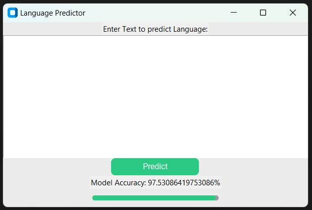
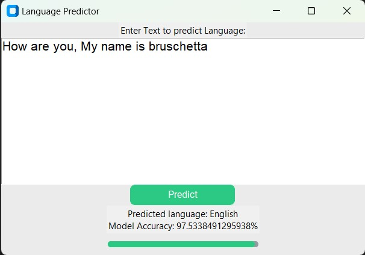

# Language Prediction Model

This project implements a Language Prediction Model using Naive Bayes classification. The model is trained on a dataset and provides predictions for the language of input text.

## Prerequisites

Make sure you have the following installed on your machine:

- Python (version 3.7 or higher)
- pip (package installer for Python)

## Installation

1. Clone the repository:
```sh
git clone https://github.com/1shChheda/Language-Prediction-Model.git
```
2. Navigate to the project directory:
```sh
cd Language-Prediction-Model
```
3. Install the required dependencies using pip:
```sh
pip install -r requirements.txt
```

## Dataset

The project uses a dataset (`newDataset.csv`) that contains text samples and their corresponding language labels. The dataset is preprocessed and split into training and testing sets.

## Project Structure

The project repository contains the following files:

- `language_prediction.ipynb`: Jupyter Notebook containing the code for training and evaluating the Language Prediction Model.
- `app.py`: Python script for running a Tkinter GUI application to interact with the trained model.
- `requirements.txt`: File specifying the required Python packages and their versions.

Additionally, the repository includes the following directories:

- `model_files`: Directory containing the saved model files (`transform.pkl`, `model.pkl`, `label_encoder.pkl`, `model_accuracy.pkl`).
- `datasets`: Directory containing the dataset files (`newDataset.csv`, `oldDataset.csv`).
- `result_images`: Directory containing images showcasing the results of the Language Prediction Model.

## Usage

1. Training the Language Prediction Model: Open and run the `language_prediction.ipynb` notebook to train and evaluate the model. The notebook provides information on model accuracy, classification report, and confusion matrix.

2. Running the GUI Application: Execute the following command to run the Tkinter GUI application:
```sh
python app.py
```
The GUI application allows you to enter text and predict the language using the trained model.

## Screenshots





## Contributors

- [Vansh Chheda](https://github.com/1shChheda)

Feel free to contribute to this project by opening issues or submitting pull requests.